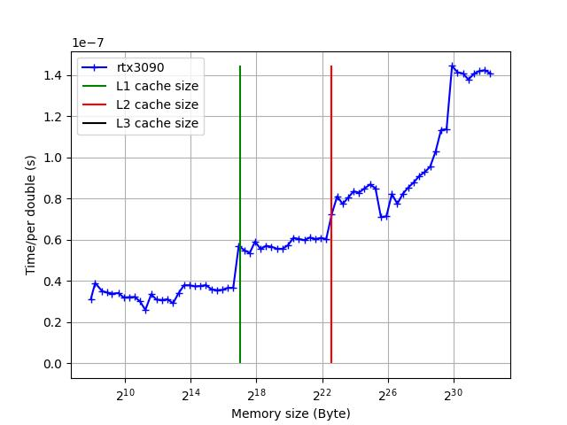
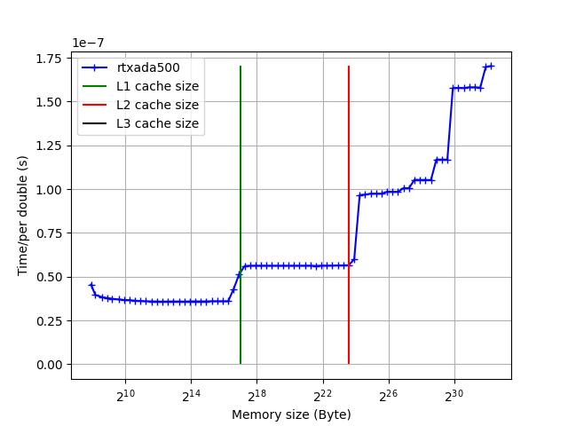

# cache_L123_cuda
Influence of cache size on program speed using cuda card

Program is loop which add two arrays

			for (int i = 0; i < nbElt; i++)
				tabC[i] = tabA[i] + tabB[i];

Program results:

WARNING 

You have to check cuda architecture in CMakeLists.txt :

set_target_properties(${nom_projet} PROPERTIES CUDA_ARCHITECTURES "86")